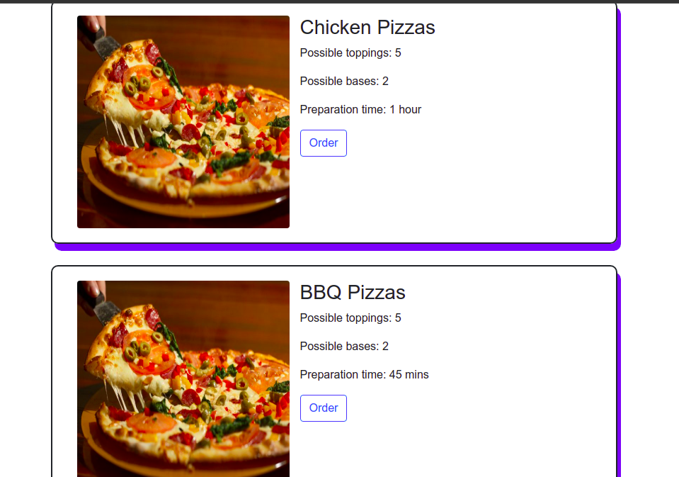
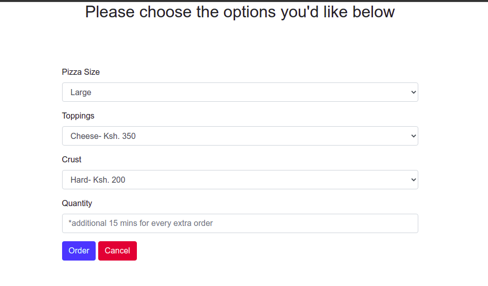

# PIZZA PALACE

  <h3 align="center">PIZZA PALACE</h3>
  

    This is an online pizza ordering site. 
     
    <a href="https://fltoki.github.io/pizzaPalace">View Demo</a>
    ·
    <a href="#">Report Bug</a>
    ·
    <a href="#">Request Feature</a>
  

   

      
TABLE OF CONTENTS

      <ol>
        <li>
          <a href="#about-the-project">About The Project</a>
          <ul>
            <li><a href="#built-using">Built Using</a></li>
          </ul>
        </li>
        <li><a href="#Navigating">Navigating</a></li>
        <li><a href="#license">License</a></li>
        <li><a href="#contact">Contact</a></li>
      </ol>
    

## Author
Built by: Musyoki Jim.
[TestAuthor](https://github.com/Y2SEM2/IP3)
## About The Project

Customers can chose what size of pizza they want, the preferred toppings and crust. The customers can also decide whether or not they want their pizza delivered

### Built Using
I used the following resources in its development
* [Bootstrap](https://getbootstrap.com)
* [JAVASCRIPT](https://javascript.com)
* [HTML](https://html.com)
* [CSS](https://css.com)

# Navigating

This is the landing page

  

Here, you can pick the type of pizza you want, each with their bases and toppings.

  

This is the order section. You can specify all the options you need including the quantity. You will then be shown your order and the total cost including the delivery cost

  

# License
Distributed under the MIT License. See `LICENSE` for more information.

## Contact
* Jim Musyoki - [Email:](https://musyokijim@gmail.com)
* Project Link: [Portfolio link](https://fltoki.github.io/ageProject)
